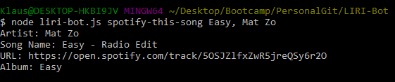
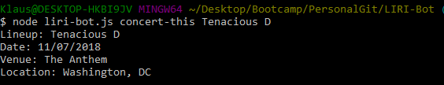
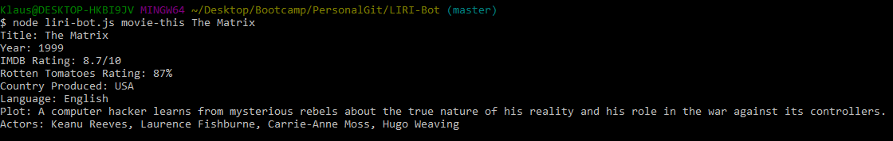
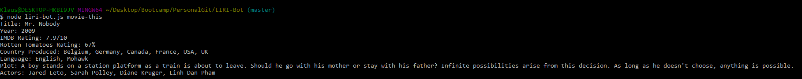
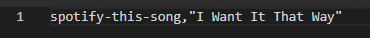
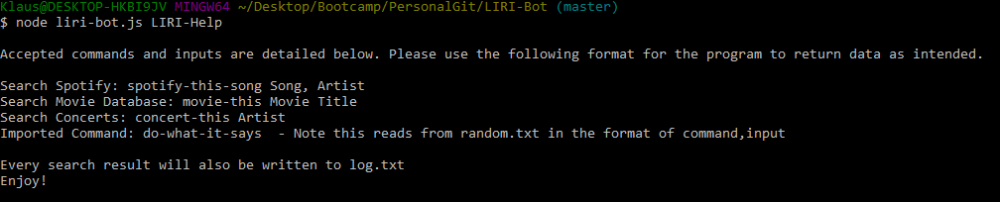
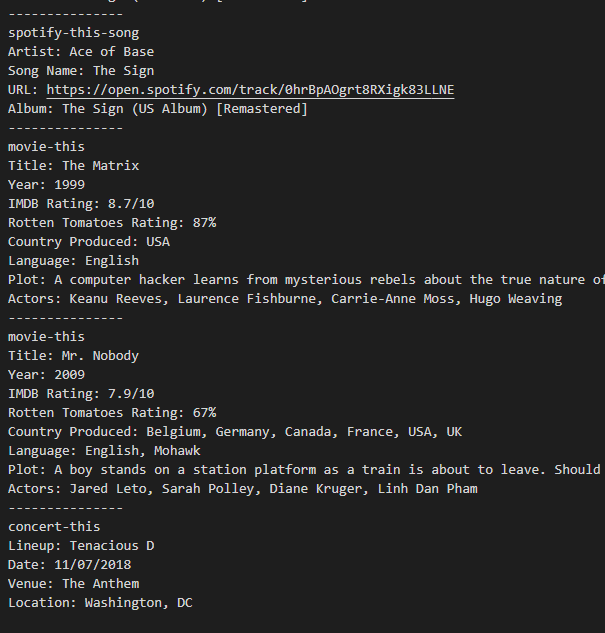

# LIRI-Bot

Title: LIRI Bot 
Developer: Kevin Flerlage 
Deployment Date: 11/05/18 
For: Northwestern Coding Bootcamp 

## Description

This is a bot which takes in the commands from the command line in Node and returns data from APIs. The commands and APIs query are listed below
- Spotify&nbsp;&nbsp;&nbsp;&nbsp;&nbsp;&nbsp;&nbsp;&nbsp;&nbsp;&nbsp;&nbsp;&nbsp;&nbsp;(spotify-this-song)
- Bands In Town&nbsp;(concert-this)
- OMDB&nbsp;&nbsp;&nbsp;&nbsp;&nbsp;&nbsp;&nbsp;&nbsp;&nbsp;&nbsp;&nbsp;&nbsp;&nbsp;&nbsp;(movie-this)

When inputting data the format should always be as follows:
- node liri-bot.js command input
- Example: node liri-bot.js spotify-this-song Easy, Mat Zo

This allows the user to hit the Spotify API and return the song name, the artist and the URL for the first song Spotify returns from that value. Examples of each are below.  

### Spotify

To search the Spotify API input the command of <strong>spotify-this-song</strong>. This takes any input desired, but it will only return the first value from the request. 

Below is a search for "Easy" by "Mat Zo" 

 

Spotify search also has a default value of The Sign by Ace of Base 

  

### Bands In Town

To search the Bands In Town API input the command of <strong>concert-this</strong>. The input for this command is any band or artist, but if the artist or input searched is not currently touring it will return a default value. 

Below is a search for "Tenacious D" 

 

### OMDB

To search the OMDB API input the command of <strong>movie-this</strong>. The input for this command should be any movie title. 

Below is a search for "The Matrix" 

 

As with Spotify, the OMDB search also has a default value. This time of Mr. Nobody 

 

### Do What It Says

The command of <strong>do-what-it-says</strong> reads the file random.txt and then executes the command in the file. The format for this must be <strong>command,input</strong>This can be any of the commands and inputs above. 

Below is the default search within random.txt. 
- This must be in the format of command,input 

 

The current format of the random file is a Spotify request which brings the value of below 

### Help

There is an imbedded help function within the LIRI bot. To access this enter LIRI-Help to the command line. This is to give the user simple instructions to use the program while within it. This will be shown if the user inputs anything other than the commands above. 

### Logs

This bot keeps a log of every request which was requested by the user and their outputs. Every time a search is successfully made the program updates log.txt with the search and the values returned. 

  

### Notes

I am happy with this assignment as this is my first entry into Node js. I could have made this program more robust with the requests. For example, trying to configure the Bands In Town API to only return data for your local area.